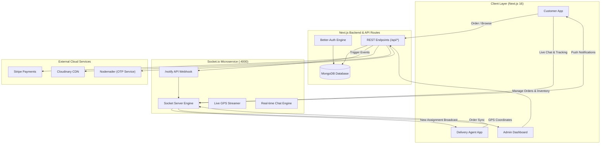

<div align="center">

# 🛒 SnapCart — Next-Gen Real-Time Grocery Delivery Platform

[](https://nextjs.org/)
[](https://react.dev/)
[](https://www.typescriptlang.org/)
[](https://tailwindcss.com/)
[](https://www.mongodb.com/)
[](https://socket.io/)
[](https://stripe.com/)

An ultra-responsive, enterprise-grade, real-time grocery e-commerce and rapid delivery platform. Featuring multi-role architecture (Customers, Delivery Agents, Admins), live GPS delivery tracking, real-time customer-driver chat, OTP verification, and gamified delivery tracking.

[Features](#-key-features) • [Tech Stack](#-technology-stack) • [Architecture](#-system-architecture) • [Getting Started](#-getting-started) • [Environment Variables](#-environment-variables)

</div>

---

## 📸 Key Features

### 👤 Customer Experience
- **Interactive Grocery Catalog**: Browse by curated categories (Fruits & Veggies, Dairy, Snacks, Beverages, etc.) with instant search, debounced filtering, and dynamic price calculations.
- **Redux-Powered Cart**: Persistent cart state with dynamic delivery fee logic (Free delivery above ₹250).
- **Interactive Map Pinpoint**: Precision location picker powered by **Leaflet** and **OpenStreetMap Nominatim Geosearching**.
- **Flexible Payments**: Seamless checkout with **Stripe Checkout API** (with webhook reconciliation) or **Cash on Delivery (COD)**.
- **Live GPS Tracking**: Real-time visualization of the delivery partner's exact route and distance to the customer's doorstep.
- **In-App Live Chat**: Instant bidirectional messaging with the assigned delivery driver.
- **Secure OTP Delivery**: 6-digit drop-off verification code sent directly to the customer's email via Nodemailer.

### 🛵 Delivery Partner Portal
- **Real-Time Request Broadcasts**: Instant notification of new delivery orders within proximity using geospatial calculations (Haversine formula).
- **Active Task Command Center**: Turn-by-turn routing context, customer contact shortcuts, order item breakdown, and direct chat.
- **Live Geolocation Streaming**: Automated background coordinate emitter (`GeoUpdater`) broadcasting location updates to the socket server.
- **Gamified Performance Tracker**:
  - Interactive daily target progress wheels with celebratory milestone confetti animations.
  - Hourly delivery trajectory charts & weekly performance analytics built with **Recharts**.
  - Real-time earnings breakdown, acceptance ratings, and badges.
- **OTP Verification Modal**: Secure delivery finalization requiring customer OTP validation.

### 🛡️ Admin Management Dashboard
- **Comprehensive Analytics**: Live metrics for total revenue, active orders, delivered volume, product count, and average order values.
- **Interactive Visualizations**: Daily revenue trends and status distribution charts.
- **Live Order Control**: Real-time socket stream of incoming orders, instant status transitions (*Pending ➔ Dispatched ➔ Out for Delivery ➔ Delivered*), and payment status toggling.
- **Inventory Management**: Cloudinary-integrated media uploads, category tagging, unit pricing, and full CRUD operations.

---

## 🛠 Technology Stack

### Frontend & Application Core
- **Framework**: [Next.js 16](https://nextjs.org/) (App Router, Turbopack, Server Actions)
- **UI & Styling**: [React 19](https://react.dev/), [Tailwind CSS v4](https://tailwindcss.com/), [Framer Motion](https://motion.dev/)
- **Icons & Graphics**: [Lucide React](https://lucide.dev/), [Canvas Confetti](https://www.npmjs.com/package/canvas-confetti)
- **Mapping & GIS**: [Leaflet](https://leafletjs.com/), [React Leaflet](https://react-leaflet.js.org/), [Leaflet Geosearch](https://github.com/smeijer/leaflet-geosearch)
- **Data Visualization**: [Recharts](https://recharts.org/)
- **State Management**: [Redux Toolkit](https://redux-toolkit.js.org/), [React Redux](https://react-redux.js.org/)

### Backend & Data
- **Database**: [MongoDB](https://www.mongodb.com/) via [Mongoose ODM](https://mongoosejs.com/)
- **Authentication**: [Better-Auth](https://www.better-auth.com/) (Email/Password, Google OAuth, GitHub OAuth, MongoDB Adapter)
- **Real-Time Layer**: [Socket.io Client](https://socket.io/docs/v4/client-api/) connected to dedicated microservice
- **Payments**: [Stripe SDK](https://stripe.com/docs/api)
- **Media Storage**: [Cloudinary SDK](https://cloudinary.com/)
- **Email Service**: [Nodemailer](https://nodemailer.com/)

---

## 🏛 System Architecture



---

## 📁 Project Structure

```
snapcart/
├── src/
│   ├── app/
│   │   ├── (auth)/             # Login, Register, Role Onboarding
│   │   ├── admin/              # Admin Dashboard, Inventory, Order Control
│   │   ├── delivery/           # Active Task, Gamified Performance Tracker
│   │   ├── user/               # Cart, Checkout, Map, Order History, Tracking
│   │   ├── api/                # 30+ Secure REST API endpoints
│   │   └── page.tsx            # Dynamic multi-role home router
│   ├── components/             # 20+ Modular UI & Feature components
│   │   ├── LiveTrackingMap.tsx # Dynamic Leaflet map with real-time marker interpolation
│   │   ├── DeliveryChat.tsx    # Live messaging window
│   │   ├── DeliveryProgressTracker.tsx # Gamified analytics & charts
│   │   └── Nav.tsx             # Role-aware responsive navigation bar
│   ├── hooks/                  # Custom React hooks (useGetMe, etc.)
│   │   └── useGetMe.tsx        # Session state hydration hook
│   ├── lib/                    # Core utilities (db, auth, socket, mailer, cloudinary, geo)
│   ├── models/                 # Mongoose schemas (User, Order, Grocery, ChatRoom, Message, Assignment)
│   ├── redux/                  # Redux Toolkit store & cartSlice
│   └── proxy.ts                # Route protection & role-based middleware
└── public/                     # Static assets & icons
```

---

## 🚀 Getting Started

### 1. Prerequisites
- **Node.js** v18.17.0+ or v20+
- **MongoDB Atlas** database cluster
- **Socket Server** running locally or deployed ([Socket Server Setup Guide](../socketServer/README.md))
- Cloudinary, Stripe, and Google/GitHub OAuth credentials

### 2. Installation
Clone the repository and install dependencies:
```bash
git clone https://github.com/akashsingh062/snapcart.git
cd snapcart/snapcart
npm install
```

### 3. Environment Configuration
Create a `.env.local` file in the `snapcart` root directory:

```env
# Database Connection
MONGODB_URL="mongodb+srv://<username>:<password>@<cluster-url>/snapcart?retryWrites=true&w=majority"

# Better-Auth Configuration
BETTER_AUTH_SECRET="your_better_auth_secret_key_here"
BETTER_AUTH_URL="http://localhost:3000"

# Next.js App Base URLs & Socket Server
NEXT_BASE_URL="http://localhost:3000"
NEXT_PUBLIC_BASE_URL="http://localhost:3000"
NEXT_PUBLIC_SOCKET_SERVER="http://localhost:4000"

# Stripe Payment Gateway
STRIPE_SECRET_KEY="sk_test_..."
STRIPE_WEBHOOK_SECRET="whsec_..."

# Cloudinary Storage
CLOUDNARY_CLOUD_NAME="your_cloud_name"
CLOUDNARY_API_KEY="your_api_key"
CLOUDNARY_API_SECRET="your_api_secret"

# OAuth Providers
GOOGLE_CLIENT_ID="your_google_client_id.apps.googleusercontent.com"
GOOGLE_CLIENT_SECRET="your_google_client_secret"
GITHUB_CLIENT_ID="your_github_client_id"
GITHUB_CLIENT_SECRET="your_github_client_secret"

# Nodemailer (OTP Mail Service)
EMAIL="your_email@gmail.com"
PASS="your_16_character_app_password"
```

### 4. Running the Development Server
Ensure the socket server is running on port `4000`, then launch the Next.js app:
```bash
npm run dev
```

Open [http://localhost:3000](http://localhost:3000) in your browser.

### 5. Production Build
```bash
npm run build
npm run start
```

---

## 🔒 Security & Best Practices
- **Role-Based Middleware (`proxy.ts`)**: Granular authorization securing `/admin/*`, `/delivery/*`, and `/user/*` routes.
- **Geospatial Queries**: MongoDB 2dsphere indexing for lightning-fast spatial queries.
- **Server Verification**: All critical order, payment, and OTP flows are validated on the server.
- **Zero Console Pollution**: Production-clean codebase with structured API error responses.

---

## 👨‍💻 Author

Developed by **[Akash Singh](https://github.com/akashsingh062)**.

Feel free to star ⭐ the repository if you found this project helpful!
